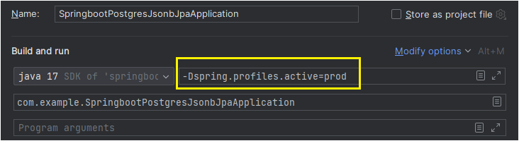

# springboot-postgres-jsonb-jpa
Application to demonstrate the JSONB data type used in PostgreSQL database using Springboot JPA implementation.

### JSON Data Types

JSON data types are for storing JSON (JavaScript Object Notation) data. Such data can also be stored as text, but the 
JSON data types have the advantage of enforcing that each stored value is valid according to the JSON rules. There are 
also assorted JSON-specific functions and operators available for data stored in these data types.

PostgreSQL offers two types for storing JSON data: 

- JSON 
- JSONB. 

To implement efficient query mechanisms for these 
data types, PostgreSQL also provides the jsonpath data type.

The json and jsonb data types accept almost identical sets of values as input. The major practical difference is one 
of efficiency. The json data type stores an exact copy of the input text, which processing functions must reparse on 
each execution; while jsonb data is stored in a decomposed binary format that makes it slightly slower to input due to 
added conversion overhead, but significantly faster to process, since no reparsing is needed. jsonb also supports 
indexing, which can be a significant advantage.

Because the json type stores an exact copy of the input text, it will preserve semantically-insignificant white space 
between tokens, as well as the order of keys within JSON objects. Also, if a JSON object within the value contains the 
same key more than once, all the key/value pairs are kept. (The processing functions consider the last value as the 
operative one.) By contrast, jsonb does not preserve white space, does not preserve the order of object keys, and does 
not keep duplicate object keys. If duplicate keys are specified in the input, only the last value is kept.

In general, most applications should prefer to store JSON data as jsonb, unless there are quite specialized needs, such 
as legacy assumptions about ordering of object keys.

JSONB is a "better" version of JSON.

Let's look at an example:

- JSON

- JSONB

In summary,

1. JSON stores white space, and that is why we can see spaces when key "a" is stored, while JSONB does not.
2. JSON stores all the values of a key. This is the reason you can see multiple values (2 and 1) against the key "a", while JSONB only "stores" the last value.
3. JSON maintains the order in which elements are inserted, while JSONB maintains the "sorted" order.
4. JSONB objects are stored as a decompressed binary as opposed to "raw data" in JSON, where no reparsing of data is required during retrieval.
5. JSONB also supports indexing, which can be a significant advantage.

### JSON Functions and Operators

This section describes:

- functions and operators for processing and creating JSON data
- the SQL/JSON path language

To provide native support for JSON data types within the SQL environment, PostgreSQL implements the SQL/JSON data model. 
This model comprises sequences of items. Each item can hold SQL scalar values, with an additional SQL/JSON null value, 
and composite data structures that use JSON arrays and objects. The model is a formalization of the implied data model 
in the JSON specification.

SQL/JSON allows you to handle JSON data alongside regular SQL data, with transaction support, including:

- Uploading JSON data into the database and storing it in regular SQL columns as character or binary strings.
- Generating JSON objects and arrays from relational data.
- Querying JSON data using SQL/JSON query functions and SQL/JSON path language expressions.

### OpenAPI Specification

### Disable OpenAPI Swagger for Production Environment

We can disable OpenAPI swagger for any environment based upon profiles. We can supply a VM argument 
'-Dspring.profiles.active=<environment name>' to the application configurations.
Using spring profile annotation @Profile("prod"), we can control the display of swagger.

- VM Argument

If the value of spring profile is 'prod', then swagger won't be available. Please refer the below screenshot:

References:

- https://www.postgresql.org/docs/current/datatype-json.html
- https://www.postgresql.org/docs/current/functions-json.html
